# MNIST Arithmetic Assignment

Build neural networks that can perform arithmetic operations (addition and multiplication) on MNIST digit images.

In this assignment, there are 🎯 Two Architectures: **Architecture 1 (End-to-end CNN)** and  **Architecture 2 (Multi-task CNN)**.

## Policy

- **✅ This is an open-book assignment.**
- **✅ Feel free to discuss concepts and approaches with classmates.**
- **✅ Each student must submit their own implementation and report.**
- **✅ You may use online resources, documentation, and tutorials.**
- **✅ Generative AI such as ChatGPT are allowed.**
- **❌ Do not copy code directly from others or share complete solutions.**

## 🎓 Learning Objectives

- Implement CNN architectures in PyTorch
- Understand training loops and validation
- Practice model evaluation and analysis

## 🏗️ Architecture Diagrams

### **Architecture 1: End-to-End CNN**

```mermaid
graph TD
    A["Combined Image<br/>(28×56)"] --> B["Conv2D Layers<br/>(1→32→64→128)<br/>MaxPool + Dropout"]    
    B --> D["Flatten + FC<br/>(2688→512→256)"]
    D --> E["Image Features<br/>(256)"]
    E --> F["Concatenate<br/>[256 + 1 = 257]"]
    C["Operation Info<br/>[op_code]"] --> F
    F --> G["Classifier<br/>(257→91)"]
    G --> H["Arithmetic Result<br/>(0-90)"]

    style A fill:#e1f5fe
    style C fill:#f3e5f5
    style H fill:#e8f5e8
    style B fill:#fff3e0
    style D fill:#fff3e0
    style F fill:#fce4ec
    style G fill:#fce4ec
```



**Key Features:**
- **Loss Function**: CrossEntropyLoss
- **Single-task learning**: Direct mapping from image to arithmetic result
- **91 output classes** (0-90 for addition/multiplication results)
- **End-to-end optimization** of entire pipeline
- **Model has 1,624,246 parameters**

### **Architecture 2: Multi-Task CNN**

```mermaid
graph TD
    A["Combined Image<br/>(28×56)"] --> B["Split<br/>28×56 → 2×(28×28)"]
    B --> C["Shared CNN<br/>Digit 1"]
    B --> D["Shared CNN<br/>Digit 2"]
    C --> E["Digit1 Prediction<br/>(10 classes)"]
    D --> F["Digit2 Prediction<br/>(10 classes)"]
    E --> G["Concatenate<br/>[10 + 10 + 1 = 21]"]
    F --> G
    H["Operation Info<br/>[op_code]"] --> G
    G --> I["Operation MLP<br/>(21→128→64)"]
    I --> J["Classifier<br/>(64→91)"]
    J --> K["Arithmetic Result<br/>(0-90)"]

    style A fill:#e1f5fe
    style H fill:#f3e5f5
    style E fill:#e8f5e8
    style F fill:#e8f5e8
    style K fill:#e8f5e8
    style C fill:#fff3e0
    style D fill:#fff3e0
    style B fill:#fff3e0
    style G fill:#fce4ec
    style I fill:#fce4ec
    style J fill:#fce4ec
```



**Key Features:**
- **Loss Function**: Multi-task Weighted Loss
- **Combined loss**: `result_loss + 0.3 * (digit1_loss + digit2_loss)`
- **Three CrossEntropyLoss** functions for each output
- **Multi-task learning** with explicit digit recognition

**Multi-task Outputs:**
- Digit 1 prediction (10 classes)
- Digit 2 prediction (10 classes)
- Arithmetic result (91 classes)

**Model has 407,845 parameters**

## 🚀 Quick Start

1. **Clone the repository**:
   ```bash
   git clone https://github.com/kasemsit/261459_mnist_arithmetic
   cd 261459_mnist_arithmetic
   ```

2. **Create and activate virtual environment**:
   ```bash
   # Create virtual environment
   python -m venv mnist_env

   # Activate virtual environment
   # On Linux/Mac:
   source mnist_env/bin/activate
   # On Windows:
   # mnist_env\Scripts\activate
   ```

3. **Install dependencies**:
   ```bash
   pip install -r requirements.txt
   ```

4. **Test the dataset**:
   ```bash
   python dataset.py
   ```

5. **Run training (after implementing templates)**:
   ```bash
   # For Architecture 1
   python main1.py

   # For Architecture 2
   python main2.py
   ```


## 📁 Files Overview

### **Provided (Ready to Use)**
- `dataset.py` - Complete MNIST arithmetic dataset with data augmentation support and reproducibility
- `requirements.txt` - All dependencies (works for both assignments)
- `main1.py` - Ready-to-run training script for Architecture 1
- `main2.py` - Ready-to-run training script for Architecture 2


### **Templates (Copy and Complete)**

**Architecture 1:**
- `model_architecture1_template.py` → copy to `model1.py`
- `trainer_architecture1_template.py` → copy to `trainer1.py`
- Run `main1.py` when completed (will run Architecture 1 only)

**Architecture 2:**
- `model_architecture2_template.py` → copy to `model2.py`
- `trainer_architecture2_template.py` → copy to `trainer2.py`
- Run `main2.py` when completed (will run Architecture 2 only)


## 📝 What to do?

1. Complete the **TODO** comments in each template file (4 files totally).
2. Train the models by `python main1.py` and `python main2.py`.
3. You can check you model implementation using `python model1.py` and `python model2.py`.
4. Success criteria ✅ is that the models train without errors and achieve >90% validation accuracy.
   
## 📝 What to submit?

1. Submit `model1.py`, `model2.py`, `trainer1.py`, and `trainer2.py`. 
2. Written report `report.pdf` that
   - shows the steps to compute **the number of parameters** for each architecture **in details** (i.e. how 1,624,246 and 407,845 parameters are derived).
   - **compares** and **discuss** about the two architectures in terms of, for example, model performance, memory efficiency, loss functions, interpretability, etc. 


Good luck! 🚀

---